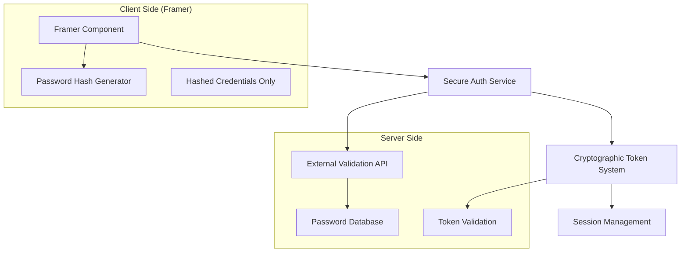

# Design Document

## Overview

The Secure Framer Authentication System addresses the critical security vulnerability in client-side authentication where passwords are exposed in component properties, network traffic, and browser storage. The solution implements a hybrid architecture combining server-side validation with cryptographic techniques to ensure credentials remain secure while maintaining seamless integration with Framer's component system.

## Architecture

### High-Level Architecture



### Security Model

The system employs multiple security layers:

1. **No Plaintext Storage**: Passwords never exist in plaintext on the client
2. **Server-Side Validation**: All authentication logic occurs server-side
3. **Cryptographic Hashing**: Client-side hashing with server-side salt verification
4. **Time-Limited Tokens**: Secure session management with automatic expiration
5. **Rate Limiting**: Protection against brute force attacks

## Components and Interfaces

### Core Components

#### 1. SecureAuthComponent
The main Framer component that replaces the existing authentication system.

```typescript
interface SecureAuthProps {
  // Configuration
  authEndpoint: string;           // External validation service URL
  gateId: string;                // Unique identifier for this auth gate
  redirectUrl?: string;          // Success redirect destination
  
  // UI Customization
  title?: string;
  placeholder?: string;
  errorMessage?: string;
  loadingMessage?: string;
  
  // Security Settings
  maxAttempts?: number;          // Rate limiting
  lockoutDuration?: number;      // Temporary lockout time
  sessionDuration?: number;      // Token validity period
  
  // Styling
  primaryColor?: string;
  backgroundColor?: string;
  textColor?: string;
}
```

#### 2. AuthValidationService
Handles secure communication with external validation endpoints.

```typescript
interface AuthValidationService {
  validateCredentials(hashedPassword: string, gateId: string): Promise<AuthResult>;
  refreshToken(token: string): Promise<TokenResult>;
  revokeAccess(gateId: string): Promise<void>;
}

interface AuthResult {
  success: boolean;
  token?: string;
  expiresAt?: number;
  error?: string;
}
```

#### 3. CryptographicHasher
Client-side password hashing with dynamic salt generation.

```typescript
interface CryptographicHasher {
  generateHash(password: string, gateId: string): Promise<string>;
  validateHashFormat(hash: string): boolean;
}
```

#### 4. SecureTokenManager
Manages authentication tokens with encryption and secure storage.

```typescript
interface SecureTokenManager {
  storeToken(gateId: string, token: string, expiresAt: number): void;
  getToken(gateId: string): string | null;
  isTokenValid(gateId: string): boolean;
  clearToken(gateId: string): void;
  clearAllTokens(): void;
}
```

### External Interfaces

#### Authentication API Endpoint
The system requires an external API endpoint for secure validation:

```typescript
// POST /api/auth/validate
interface ValidationRequest {
  hashedPassword: string;
  gateId: string;
  timestamp: number;
  nonce: string;
}

interface ValidationResponse {
  success: boolean;
  token?: string;
  expiresAt?: number;
  error?: string;
  remainingAttempts?: number;
}
```

## Data Models

### Authentication State
```typescript
interface AuthState {
  isAuthenticated: boolean;
  isLoading: boolean;
  error: string | null;
  attemptsRemaining: number;
  lockedUntil: number | null;
  token: string | null;
  expiresAt: number | null;
}
```

### Security Configuration
```typescript
interface SecurityConfig {
  hashAlgorithm: 'SHA-256' | 'PBKDF2';
  saltRounds: number;
  tokenEncryption: boolean;
  storageType: 'sessionStorage' | 'localStorage' | 'memory';
  csrfProtection: boolean;
}
```

### Gate Configuration
```typescript
interface GateConfig {
  gateId: string;
  authEndpoint: string;
  maxAttempts: number;
  lockoutDuration: number;
  sessionDuration: number;
  allowedOrigins: string[];
}
```

## Error Handling

### Error Categories

1. **Network Errors**: API unavailable, timeout, connection issues
2. **Authentication Errors**: Invalid credentials, account locked, expired tokens
3. **Configuration Errors**: Invalid endpoints, missing required parameters
4. **Security Errors**: CSRF attacks, invalid origins, malformed requests

### Error Recovery Strategies

```typescript
interface ErrorHandler {
  handleNetworkError(error: NetworkError): Promise<void>;
  handleAuthError(error: AuthError): Promise<void>;
  handleConfigError(error: ConfigError): Promise<void>;
  handleSecurityError(error: SecurityError): Promise<void>;
}
```

### Fallback Mechanisms

- **Offline Mode**: Cached token validation for temporary network issues
- **Graceful Degradation**: Basic functionality when advanced features fail
- **User Feedback**: Clear error messages with actionable guidance
- **Retry Logic**: Exponential backoff for transient failures

## Testing Strategy

### Unit Testing
- **Component Rendering**: UI states, prop handling, event responses
- **Cryptographic Functions**: Hash generation, token validation, encryption
- **Service Layer**: API communication, error handling, state management
- **Security Functions**: Input validation, CSRF protection, rate limiting

### Integration Testing
- **End-to-End Authentication Flow**: Complete user journey from login to access
- **API Integration**: External service communication and error scenarios
- **Cross-Browser Compatibility**: Ensure consistent behavior across browsers
- **Security Validation**: Penetration testing and vulnerability assessment

### Security Testing
- **Password Exposure**: Verify no plaintext passwords in any storage or network traffic
- **Token Security**: Validate token encryption, expiration, and secure transmission
- **Rate Limiting**: Test brute force protection and lockout mechanisms
- **CSRF Protection**: Verify protection against cross-site request forgery

### Performance Testing
- **Hash Generation Speed**: Ensure acceptable performance for password hashing
- **API Response Times**: Monitor authentication service performance
- **Memory Usage**: Validate efficient token and state management
- **Network Efficiency**: Minimize authentication-related network overhead

## Implementation Architecture

### Single File Component Design
**CRITICAL DESIGN DECISION**: All Framer components must be completely self-contained in a single .tsx file to ensure:
- **Copy-paste simplicity**: Users can copy one file into Framer and have it work immediately
- **No dependency management**: No need to manage multiple files or imports
- **Framer compatibility**: Aligns with Framer's component architecture expectations
- **Reduced complexity**: Easier maintenance and debugging

### Phase 1: Integrated Security Infrastructure
- Implement cryptographic hashing system within main component
- Create secure token management within main component
- Build external API communication layer within main component
- Establish error handling framework within main component

### Phase 2: Complete Framer Component
- Develop SecureAuthComponent with all utilities integrated
- Implement UI states and user feedback
- Add customization options and theming
- Include all interfaces and types within the component file

### Phase 3: External Services (Separate Files)
- Build external API endpoints for password validation
- Create password management utilities for server setup
- Implement deployment and configuration tools
- Add documentation and setup guides

### Phase 4: Management and Monitoring (External Tools)
- Build password setup and configuration utilities
- Create access analytics and monitoring tools
- Implement emergency lockout features
- Add multi-gate management utilities

### Component Structure
```
SecureAuth.tsx (Single File)
├── Type Definitions
├── Cryptographic Utilities (integrated)
├── Token Management (integrated)
├── API Communication (integrated)
├── Error Handling (integrated)
├── Main React Component
└── Framer Property Controls
```

## Security Considerations

### Client-Side Protection
- **No Plaintext Storage**: All passwords hashed before any storage
- **Secure Hashing**: Use PBKDF2 or similar with dynamic salts
- **Token Encryption**: Encrypt tokens before browser storage
- **Memory Management**: Clear sensitive data from memory after use

### Server-Side Protection
- **Secure Endpoints**: HTTPS-only communication with proper certificates
- **Input Validation**: Comprehensive validation of all incoming data
- **Rate Limiting**: Server-side protection against brute force attacks
- **Audit Logging**: Complete logging of authentication attempts and outcomes

### Network Security
- **HTTPS Enforcement**: All communication over encrypted connections
- **CSRF Protection**: Tokens and origin validation
- **Request Signing**: Cryptographic signatures for API requests
- **Replay Protection**: Nonce and timestamp validation

This design provides a comprehensive solution to the security challenges in Framer authentication while maintaining usability and integration with Framer's component system.